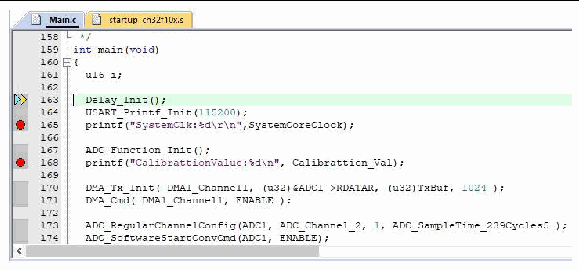

<!-- source-page: 9 -->

[← p.8](0008.md) · [index](../README.md) · [PDF p.9](https://ch32-riscv-ug.github.io/WCH-common/datasheet_en/WCH-LinkUserManual.PDF#page=9) · [p.10 →](0010.md)

<!-- header: WCH-LinkUserManual https://wch-ic.com -->

 <!-- p9-draw-image-00002 rendered from the PDF -->

③ Basic debug commands  
<!-- image: p9-draw-image-00003 bbox=[68.04, 219.72, 90.12, 234.24] -->
Reset: Perform a reset operation on the program.  
<!-- image: p9-draw-image-00004 bbox=[68.04, 250.68, 86.76, 265.68] -->
Run: Cause the current program to start running at full speed until the program stops when it  
encounters a breakpoint.  
<!-- image: p9-draw-image-00005 bbox=[68.04, 297.48, 86.76, 312.48] -->
Step: Execute a single statement and if a function is encountered, it will go inside the function.  
<!-- image: p9-draw-image-00006 bbox=[68.04, 328.92, 90.12, 343.44] -->
Step Over: Execute a single statement that does not go inside the function if it encounters a function,  
but runs the function at full speed and jumps to the next statement.  
<!-- image: p9-draw-image-00007 bbox=[68.04, 375.48, 86.76, 390.48] -->
Step Out: Run all the contents after the current function at full-speed until the function returns to the  
previous level.  
<!-- image: p9-draw-image-00008 bbox=[187.32, 421.56, 205.32, 438.0] -->
④ Click the Debug button in the toolbar again to exit debug.  
<!-- image: p9-draw-image-00001 bbox=[508.2, 795.0, 527.28, 805.2] -->
<!-- footer: V2.5 9 -->
