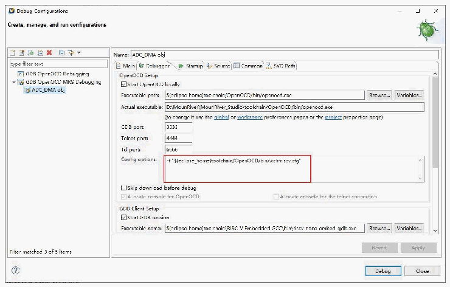
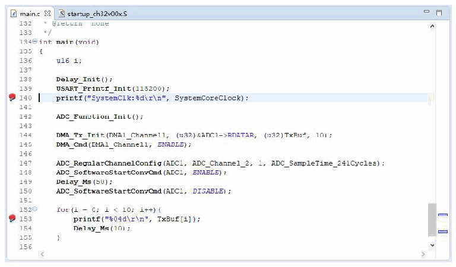

<!-- source-page: 11 -->

[← p.10](0010.md) · [index](../README.md) · [PDF p.11](https://ch32-riscv-ug.github.io/WCH-common/datasheet_en/WCH-LinkUserManual.PDF#page=11) · [p.12 →](0012.md)

<!-- header: WCH-LinkUserManual https://wch-ic.com -->

 <!-- p11-draw-image-00002 rendered from the PDF -->

② Set breakpoints  

 <!-- p11-draw-image-00003 rendered from the PDF -->

③ Basic debug commands  
<!-- image: p11-draw-image-00004 bbox=[68.04, 547.32, 90.12, 561.84] -->
Reset: Perform a reset operation on the program.  
<!-- image: p11-draw-image-00005 bbox=[68.04, 578.28, 86.76, 593.28] -->
Run: Make the current program start running at full speed until the program stops when it meets a  
breakpoint.  
<!-- image: p11-draw-image-00006 bbox=[68.04, 625.32, 90.12, 639.84] -->
Terminate: Exit debugging.  
<!-- image: p11-draw-image-00007 bbox=[68.04, 656.28, 86.76, 671.28] -->
Step Into: Execute a single statement, and if a function is encountered, it will go inside the function.  
<!-- image: p11-draw-image-00008 bbox=[68.04, 687.48, 86.76, 702.48] -->
Step Over: Execute a single statement, and if it encounters a function, it will not go inside the function,  
but run the function at full speed and skip to the next statement.  
<!-- image: p11-draw-image-00009 bbox=[68.04, 734.28, 86.76, 749.28] -->
Step Return: Run all contents after the current function at full speed until the function returns to the  
previous level.  
<!-- image: p11-draw-image-00001 bbox=[508.2, 795.0, 527.28, 805.2] -->
<!-- footer: V2.5 11 -->
