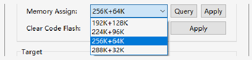

<!-- source-page: 12 -->

[← p.11](0011.md) · [index](../README.md) · [PDF p.12](https://ch32-riscv-ug.github.io/WCH-common/datasheet_en/WCH-LinkUserManual.PDF#page=12) · [p.13 →](0013.md)

<!-- header: WCH-LinkUserManual https://wch-ic.com -->
<!-- image: p12-draw-image-00002 bbox=[117.0, 63.48, 135.72, 78.48] -->
④ Click button, exit the debug.  

## 4.3 Other Functions

### 4.3.1 Set Chip Read-Protect

<!-- image: p12-draw-image-00003 bbox=[68.04, 138.24, 96.96, 159.72] -->
Query chip read-protect status  
<!-- image: p12-draw-image-00004 bbox=[68.04, 169.44, 96.96, 190.92] -->
Enable chip read-protect status  
<!-- image: p12-draw-image-00005 bbox=[68.04, 200.64, 96.96, 222.12] -->
Disable chip read-protect status  

### 4.3.2 Code Flash Full Erase

MounRiver Studio can erase all the user areas of the chip by controlling the hardware reset pin or by  
re-powering the chip. To control erase by re-powering, Link is required to power the chip; to control erase by  
hardware reset pin, the reset pins of the chip and Link need to be connected. (Supported by WCH-LinkE,  
WCH-DAPLink and WCH-LinkW only)  
<!-- image: p12-draw-image-00006 bbox=[196.08, 322.92, 399.24, 351.84] -->

### 4.3.3 Disable 2-wire SDI

For partial chips, code and data protection can be enabled by disabling the 2-wire SDI.  
<!-- image: p12-draw-image-00007 bbox=[68.04, 403.44, 96.96, 424.92] -->
Disable the 2-wire SDI  

### 4.3.4 Chip Memory Allocation

For high-capacity general-purpose (connected/interconnected/wireless) chips, memory allocation is available  
through MounRiver Studio; please refer to the User Selection Word section of the CH32FV2x_V3xRM  
manual for details.  

 <!-- p12-draw-image-00008 rendered from the PDF -->

<!-- image: p12-draw-image-00001 bbox=[508.2, 795.0, 527.28, 805.2] -->
<!-- footer: V2.5 12 -->
