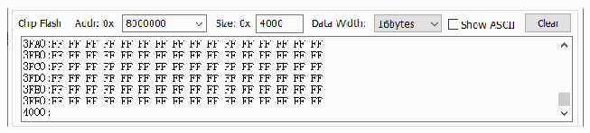
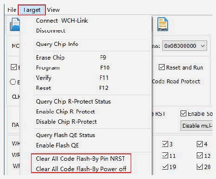
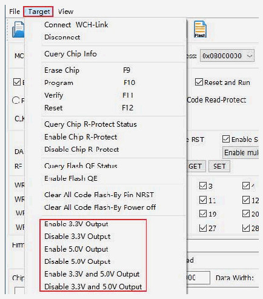

<!-- source-page: 14 -->

[← p.13](0013.md) · [index](../README.md) · [PDF p.14](https://ch32-riscv-ug.github.io/WCH-common/datasheet_en/WCH-LinkUserManual.PDF#page=14) · [p.15 →](0015.md)

<!-- header: WCH-LinkUserManual https://wch-ic.com -->

 <!-- p14-draw-image-00002 rendered from the PDF -->

### 5.2.4 Code Flash Full Erase

The WCH-LinkUtility tool can erase all user areas of the chip by controlling the hardware reset pin or by  
re-powering the chip. To control erase by re-powering, Link is required to power the chip; to control erase by  
hardware reset pin, the reset pins of the chip and Link are required to be connected. (Supported by  
WCH-LinkE, WCH-DAPLink and WCH-LinkW only)  

 <!-- p14-draw-image-00003 rendered from the PDF -->

### 5.2.5 Power Output Controllable

WCH-LinkUtility tool can control Link power output. Click on Target and choose to turn on/off the power  
supply 3.3V/5V output in the drop-down list. (Supported by WCH-LinkE, WCH-DAPLink and  
WCH-LinkW only)  

 <!-- p14-draw-image-00004 rendered from the PDF -->

### 5.2.6 Automatic Continuous Download

Tick Auto download when WCH-Link was linked to enable automatic continuous download of the project.  
<!-- image: p14-draw-image-00005 bbox=[112.32, 744.84, 482.88, 772.32] -->
<!-- image: p14-draw-image-00001 bbox=[508.2, 795.0, 527.28, 805.2] -->
<!-- footer: V2.5 14 -->
