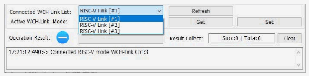
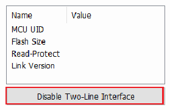
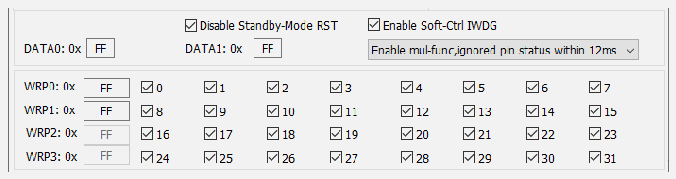

<!-- source-page: 15 -->

[← p.14](0014.md) · [index](../README.md) · [PDF p.15](https://ch32-riscv-ug.github.io/WCH-common/datasheet_en/WCH-LinkUserManual.PDF#page=15) · [p.16 →](0016.md)

<!-- header: WCH-LinkUserManual https://wch-ic.com -->

### 5.2.7 Multi-Device Download

The WCH-LinkUtility tool can recognize multiple Link devices. When multiple Links are connected, the  
Connected WCH-Link List option box allows you to select a specific Link device for downloading.  

 <!-- p15-draw-image-00002 rendered from the PDF -->

### 5.2.8 Turn off the 2-wire Debug Interface

For partial chips, code and data protection can be enabled by closing the two-wire debug interface.  

 <!-- p15-draw-image-00003 rendered from the PDF -->

### 5.2.9 User Select Word Configuration

For CH32 series chips, user selectable word configuration can be done through the WCH-LinkUtility tool.  
For details, please refer to the user selectable word section in the RM manual.  
<!-- image: p15-draw-image-00004 bbox=[180.96, 391.92, 414.24, 407.76] -->

 <!-- p15-draw-image-00005 rendered from the PDF -->

### 5.2.10 BOOT Download

For CH32V003, CH641, CH32V002_004_005_006_007, CH32M007, CH32X035_X033 chip, you can  
select program download to program flash memory storage or system storage by WCH-LinkUtility tool.  
<!-- image: p15-draw-image-00006 bbox=[163.68, 575.04, 431.64, 614.64] -->

### 5.2.11 SDI Virtual Serial Port Function

This function uses the SDI interface to realize the chip printout function, which needs to modify the printing  
function. Refer to the SDI_Printf routine in the relevant EVT. This function is only supported in V1.80 and  
above. You need to check EnableSDIPrintf and open the COM port of WCH-LinkE.  
<!-- image: p15-draw-image-00001 bbox=[508.2, 795.0, 527.28, 805.2] -->
<!-- footer: V2.5 15 -->
