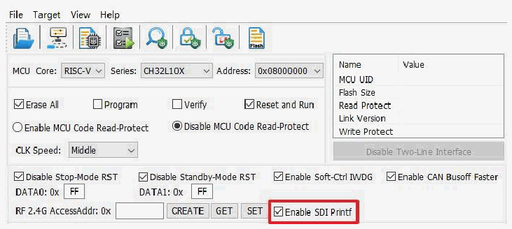

<!-- source-page: 16 -->

[← p.15](0015.md) · [index](../README.md) · [PDF p.16](https://ch32-riscv-ug.github.io/WCH-common/datasheet_en/WCH-LinkUserManual.PDF#page=16) · [p.17 →](0017.md)

<!-- header: WCH-LinkUserManual https://wch-ic.com -->

 <!-- p16-draw-image-00002 rendered from the PDF -->

<em>Note:</em>  
- <em>(1) This feature is only supported in V1.80 and above.</em>
- <em>(2) This feature is only supported by WCH-LinkE.</em>
- <em>(3) The supporting chip includes CH32V003, CH32V103, CH32V20x, CH32V30x, CH32X035_X033,</em>
<em>CH32L103, CH641, CH32V002_004_005_006_007, CH32M007, CH32M030, CH32V317,</em>  
<em>CH32V205_203CC, CH32V407_467, CH32X305_315.</em>  
<!-- image: p16-draw-image-00001 bbox=[508.2, 795.0, 527.28, 805.2] -->
<!-- footer: V2.5 16 -->
