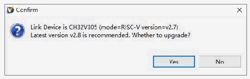
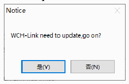

<!-- source-page: 17 -->

[← p.16](0016.md) · [index](../README.md) · [PDF p.17](https://ch32-riscv-ug.github.io/WCH-common/datasheet_en/WCH-LinkUserManual.PDF#page=17) · [p.18 →](0018.md)

<!-- header: WCH-LinkUserManual https://wch-ic.com -->

# 6 Firmware Update Methods

## 6.1 MounRiver Studio Online Update

If the firmware needs to be updated, MounRiver Studio will have a pop-up window to remind you when you  
click the download button, click Yes to start the update.  

 <!-- p17-draw-image-00002 rendered from the PDF -->

## 6.2 WCH-LinkUtility Online Update

If the firmware needs to be updated, WCH-LinkUtility will have a pop-up window to remind you when you  
click the download button, click Yes to start the update.  

 <!-- p17-draw-image-00003 rendered from the PDF -->

<em>Notes:</em>  
- <em>(1) WCH-LinkE supports manual online update, the steps are as follows.</em>
<em>● Power up the Link after long press the IAP button until the blue LED blinks.</em>  
<em>● MounRiver Studio/WCH-LinkUtility will have a pop-up window to remind you when you click the</em>  
<em>download button, click Yes to start the update.</em>  
- <em>(2) If the Link firmware update is abnormal, please update the firmware by offline update.</em>

## 6.3 WCH-LinkUtility Offline Update (2-wire Approach to Offline Update)

① Connect WCH-LinkE with WCH-LinkE to be updated  

<!-- p17-table-001 (unlabelled-p17-1) -->
<table><tr><th>WCH-LinkE</th><th>Link to be updated</th></tr><tr><td>3V3</td><td>3V3</td></tr><tr><td>GND</td><td>GND</td></tr><tr><td>SWDIO</td><td>SWDIO</td></tr><tr><td>SWCLK</td><td>SWCLK</td></tr></table>

② WCH-LinkE power on, select the Link chip model to be updated (WCH-LinkE main control chip is  
CH32V30x)  
③ To be updated Link into IAP mode (long press the IAP button to power up the Link, that is, through the  
USB port connected to the computer to power up)  
④ Click Target-&gt;Clear All Code Flash-By Power off to erase all the user area of the chip  
<!-- image: p17-draw-image-00001 bbox=[508.2, 795.0, 527.28, 805.2] -->
<!-- footer: V2.5 17 -->
