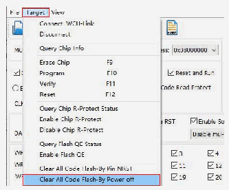
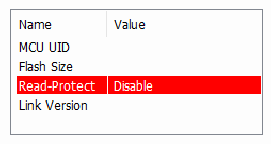
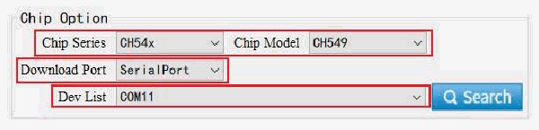

<!-- source-page: 18 -->

[← p.17](0017.md) · [index](../README.md) · [PDF p.18](https://ch32-riscv-ug.github.io/WCH-common/datasheet_en/WCH-LinkUserManual.PDF#page=18) · [p.19 →](0019.md)

<!-- header: WCH-LinkUserManual https://wch-ic.com -->

 <!-- p18-draw-image-00002 rendered from the PDF -->

<!-- image: p18-draw-image-00003 bbox=[137.76, 200.88, 162.96, 221.88] -->
⑤ Click icon , diaable chip read-protect  

 <!-- p18-draw-image-00004 rendered from the PDF -->

<!-- image: p18-draw-image-00005 bbox=[137.76, 294.24, 160.44, 315.72] -->
⑥ Click icon , add Link offline updated firmware  
⑦ Configuration options (Program + Verify + Reset and Run)  
<!-- image: p18-draw-image-00006 bbox=[183.6, 342.72, 411.6, 363.36] -->
<!-- image: p18-draw-image-00007 bbox=[137.76, 372.48, 162.96, 393.48] -->
⑧ Click icon to execute download  
<em>Notes:</em>  
- <em>(1) The Link to be updated is limited to WCH-LinkE.</em>
- <em>(2) Two WCH-LinkE are required for this method.</em>
- <em>(3) When Link enters IAP mode, the blue LED flashes.</em>

## 6.4 WCHISPStudio Serial Port Offline Update

① Connect WCH-Link with USB to TTL module  

<!-- p18-table-001 (unlabelled-p18-1) -->
<table><tr><th>WCH-Link</th><th>USB to TTL module</th></tr><tr><td>TX</td><td>RX</td></tr><tr><td>RX</td><td>TX</td></tr><tr><td>GND</td><td>GND</td></tr></table>

② USB to TTL module power on, WCH-Link into BOOT mode (short connection J1 in Figure 1 will Link  
power on)  
③ Select chip model: CH549, download interface: serial port, device list: select the serial port number  
corresponding to the USB to TTL module  

 <!-- p18-draw-image-00008 rendered from the PDF -->

④ Add Link offline updated firmware to target program file  
⑤ Download configuration  
<!-- image: p18-draw-image-00001 bbox=[508.2, 795.0, 527.28, 805.2] -->
<!-- footer: V2.5 18 -->
