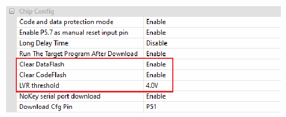
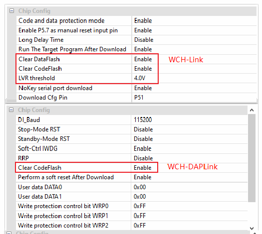
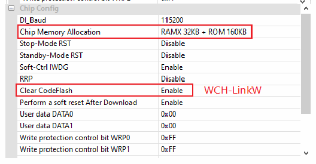

<!-- source-page: 19 -->

[← p.18](0018.md) · [index](../README.md) · [PDF p.19](https://ch32-riscv-ug.github.io/WCH-common/datasheet_en/WCH-LinkUserManual.PDF#page=19) · [p.20 →](0020.md)

<!-- header: WCH-LinkUserManual https://wch-ic.com -->

 <!-- p19-draw-image-00002 rendered from the PDF -->

⑥ Click the download button  
⑦ Click on the download and wait for the device to access the field, then plug the WCH-Link into the  
USB port, the ISP tool automatically began to download  
<em>Note: Serial port offline update is only supported by WCH-Link.</em>  

## 6.5 WCHISPStudio USB Offline Update

① To update the Link into BOOT mode (short connect J1 in Figure 1 or long press BOOT key and then  
power up the Link)  
② WCHISPStudio tool will automatically pop up the adaptation window  
③ Add Link offline upgrade firmware to the target program file  
④ Download configuration  

 <!-- p19-draw-image-00003 rendered from the PDF -->

 <!-- p19-draw-image-00004 rendered from the PDF -->

⑤ Click the download button  
<em>Notes:</em>  
- <em>(1) USB offline update is only supported by WCH-Link, WCH-DAPLink and WCH-LinkW.</em>
- <em>(2) WCH-LinkE-R0-1v3 and WCH-DAPLink-R0-2v0 are only available for firmware version v2.8 and above.</em>
- <em>(3) WCH-LinkUtility tool can be exported through MounRiver Studio software.</em>
<!-- image: p19-draw-image-00001 bbox=[508.2, 795.0, 527.28, 805.2] -->
<!-- footer: V2.5 19 -->
