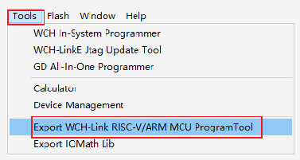
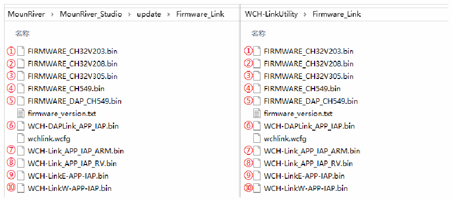

<!-- source-page: 20 -->

[← p.19](0019.md) · [index](../README.md) · [PDF p.20](https://ch32-riscv-ug.github.io/WCH-common/datasheet_en/WCH-LinkUserManual.PDF#page=20) · [p.21 →](0021.md)

<!-- header: WCH-LinkUserManual https://wch-ic.com -->

 <!-- p20-draw-image-00002 rendered from the PDF -->

- <em>(4) Link offline upgrade firmware is located in the MounRiver Studio installation path and WCH-LinkUtility</em>
<em>installation path.</em>  

 <!-- p20-draw-image-00003 rendered from the PDF -->

<em>① WCH-DAPLink upgrade firmware</em>  
<em>② WCH-LinkW upgrade firmware</em>  
<em>③ WCH-LinkE upgrade firmware</em>  
<em>④ WCH-Link RISC-V mode upgrade firmware</em>  
<em>⑤ WCH-Link ARM mode upgrade firmware</em>  
<em>⑥ WCH-DAPLink offline upgrade firmware</em>  
<em>⑦ WCH-Link ARM mode offline upgrade firmware</em>  
<em>⑧ WCH-Link RISC-V mode offline upgrade firmware</em>  
<em>⑨ WCH-LinkE offline upgrade firmware</em>  
<em>⑩ WCH-LinkW offline upgrade firmware</em>  
<!-- image: p20-draw-image-00001 bbox=[508.2, 795.0, 527.28, 805.2] -->
<!-- footer: V2.5 20 -->
