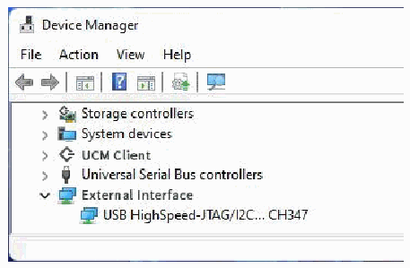
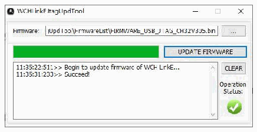

<!-- source-page: 21 -->

[← p.20](0020.md) · [index](../README.md) · [PDF p.21](https://ch32-riscv-ug.github.io/WCH-common/datasheet_en/WCH-LinkUserManual.PDF#page=21) · [p.22 →](0022.md)

<!-- header: WCH-LinkUserManual https://wch-ic.com -->

# 7 WCH-LinkE High-speed JTAG

## 7.1 Module Overview

The WCH-LinkE-R0-1v3 provides a JTAG interface that supports 4-wire connections (TMS, TCK, TDI and  
TDO wires) for extending the JTAG interface for computers to operate CPUs, DSPs, FPGAs, CPLDs and  
other devices.  

Figure 3 WCH-LinkE high-speed JTAG mode  
 <!-- rendered from the PDF; verify at https://ch32-riscv-ug.github.io/WCH-common/datasheet_en/WCH-LinkUserManual.PDF#page=21 -->

🖼 Text parsed from the figure above

<!-- image: p21-draw-image-00002 inside the figure -->

## 7.2 Module Features

● As Host/Master host mode.  
● JTAG interface provides TMS wire, TCK wire, TDI wire and TDO wire.  
● Support high-speed USB data transfer.  
● Flexible operation of CPU, DSP, FPGA and CPLD devices through computer API cooperation.  

## 7.3 Module Switching

The WCH-LinkE-R0-1v3 can be upgraded to high-speed JTAG mode via the WCHLinkEJtagUpdTool tool,  
download the steps as follows.  
① WCH-LinkE-R0-1v3 into IAP mode (long press the IAP button to power up the Link, i.e., connect to  
the computer through the USB port to power up), at this time the blue LED flashes.  
② Open WCHLinkEJtagUpdTool tool, execute the download (WCH-LinkE high-speed JTAG upgrade  
firmware has been automatically added).  
③ Firmware update is complete, at this time the blue LED is always on.  

 <!-- p21-draw-image-00003 rendered from the PDF -->

<em>Notes.</em>  
- <em>(1) WCHLinkEJtagUpdTool get URL: https://www.wch.cn/downloads/WCHLinkEJtagUpdTool_ZIP.html</em>
- <em>(2) The firmware can be updated offline by WCH-LinkUtility tool, please refer to manual 6.3</em>
<em>WCH-LinkUtility Offline Update for details.</em>  
- <em>(3) WCH-LinkE high-speed JTAG offline update firmware is located in the WCHLinkEJtagUpdTool</em>
<em>installation path.</em>  
<!-- image: p21-draw-image-00001 bbox=[508.2, 795.0, 527.28, 805.2] -->
<!-- footer: V2.5 21 -->
