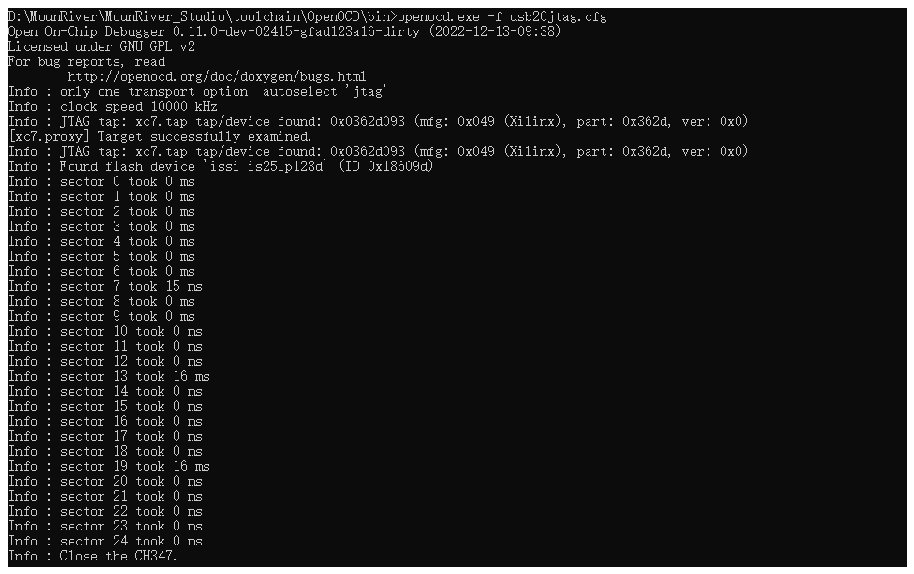

<!-- source-page: 23 -->

[← p.22](0022.md) · [index](../README.md) · [PDF p.23](https://ch32-riscv-ug.github.io/WCH-common/datasheet_en/WCH-LinkUserManual.PDF#page=23) · [p.24 →](0024.md)

<!-- header: WCH-LinkUserManual https://wch-ic.com -->
runtest 2000  
irscan xc7.tap $XC7_BYPASS  
runtest 2000  
exit  
③ Run the command: openocd.exe -f usb20jtag.cfg in Windows terminal and execute it as follows.  

 <!-- p23-draw-image-00002 rendered from the PDF -->

④ The download is over and the device is running normally.  
<em>Notes.</em>  
- <em>(1) conversion role of the Bit file, with the help of Github open source project:</em>
<em>https://github.com/quartiq/bscan_spi_bitstreams</em>  
- <em>(2) openocd.exe file location: MounRiver\MounRiver_Studio\toolchain\OpenOCD\bin</em>
<!-- image: p23-draw-image-00001 bbox=[508.2, 795.0, 527.28, 805.2] -->
<!-- footer: V2.5 23 -->
