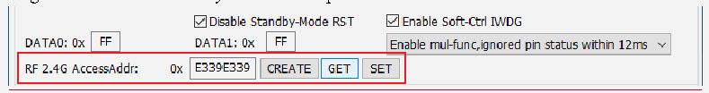

<!-- source-page: 25 -->

[← p.24](0024.md) · [index](../README.md) · [PDF p.25](https://ch32-riscv-ug.github.io/WCH-common/datasheet_en/WCH-LinkUserManual.PDF#page=25) · [p.26 →](0026.md)

<!-- header: WCH-LinkUserManual https://wch-ic.com -->
SWCLK/TCK SWCLK  
SWDIO/TMS SWDIO  
Slave GND GND  
Emulator Target Board  
3V3 3V3  
USB USB PC  
Host  
Emulator  
<em>Note: Using Code Flash full erase and power output controllable function requires connecting to the slave</em>  
<em>USB port via charging head or mobile power to power the slave and MCU.</em>  

## 8.3 Wireless Mode Access Address Match

When WCH-LinkW uses wireless mode for downloading and debugging, it is necessary to ensure that the  
wireless mode access addresses of the host and slave are the same. You can set the wireless mode access  
address through the WCH-LinkUtility tool. The steps are as follows:  

 <!-- p25-draw-image-00002 rendered from the PDF -->

① Connect WCH-LinkW wireless mode host and slave to computer respectively, click GET button, check  
whether the current host and slave access addresses are the same, if they are the same and not 0xE339E339,  
execute step 4, otherwise execute step 2  
② Click CREATE button to create a random address  
③ Click SET button to set the access address of host and slave respectively  
④ The slave connects to the MCU to power on first, then the host connects to the computer, and the green  
light will light up to use the wireless mode normally  
<em>Notes:</em>  
- <em>(1) The factory default WCH-LinkW wireless mode access address is 0xE339E339.</em>
- <em>(2) When wireless mode, only one pair of WCH-LinkW wireless access address should be guaranteed to be</em>
<em>the same in the same usage environment. If there are more than one pair of devices, you need to use the</em>  
<em>above steps to set different wireless mode access addresses.</em>  
<!-- image: p25-draw-image-00001 bbox=[508.2, 795.0, 527.28, 805.2] -->
<!-- footer: V2.5 25 -->
