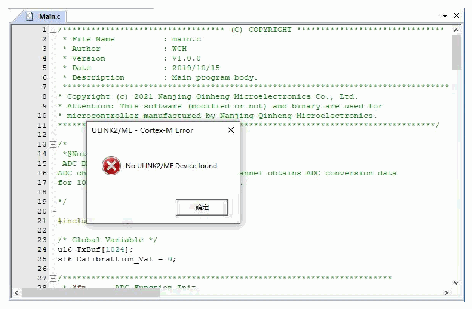
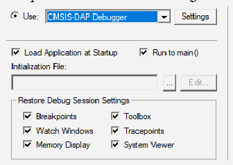
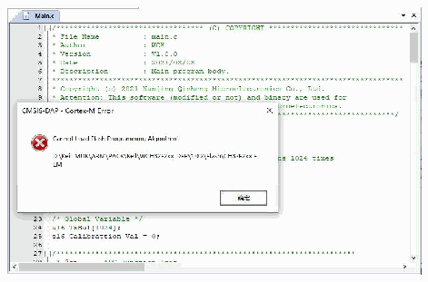
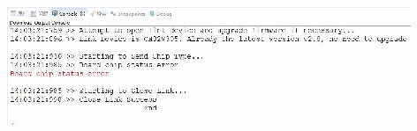

<!-- source-page: 26 -->

[← p.25](0025.md) · [index](../README.md) · [PDF p.26](https://ch32-riscv-ug.github.io/WCH-common/datasheet_en/WCH-LinkUserManual.PDF#page=26) · [p.27 →](0027.md)

<!-- header: WCH-LinkUserManual https://wch-ic.com -->

# 9 Typical Problem Statement

<!-- p26-table-001 (unlabelled-p26-1) pages 26-27 -->
<table><tr><th>Error Alert</th><th>Solution</th></tr><tr><td>Use Keil software to download</td><td style="text-align:left">1. Please refer to manual 3.2 Download configuration to complete Keil download configuration.</td></tr><tr><td>Use Keil software to download</td><td style="text-align:left">1. The RAM space size of our CH32F20x series chips is 0x2800.</td></tr><tr><td style="text-align:left">Use MounRiver Studio software to download</td><td style="text-align:left">1. Check whether the chip&#x27;s two-wire debug interface is correctly connected to Link. 2. Check whether the Debug function of the chip is turned on (if not, it can be turned on through the ISP tool). 3. Check whether the user program inside the chip is open to sleep function and whether there is an operation of FLASHrelated functions (if open, you can enter BOOT mode and download through two lines). 4. Check whether the two-wire debug interface of the user program inside the chip is multiplexed as a common GPIO port (if multiplexed, you can enter BOOT mode and download through two wires). Note: (1) For CH32 series chips, if the download is not successful, you can enter BOOT mode (BOOT0 to VCC, BOOT1 to GND) and download through Link. (2) For 3 and 4, the problem can be solved by WCH-LinkUtility tool to erase all the user area of the chip (refer to Chapter 5of the manual for WCH-LinkUtility download).</td></tr><tr><td>Use the WCH-LinkUtility tool to download</td><td style="text-align:left">Erase all user areas of the chip</td></tr><tr><td style="text-align:left">Update firmware using WCHLinkEJtagUpdTool tool After updating the firmware according to manual 7.3 Mode Switching Download Procedure, the blue LED on the WCH-LinkE-R0-1v3 does not light up and the Device Manager cannot recognize the device.</td><td style="text-align:left">1. Analysis of the cause, may be the WCH-LinkE-R0-1v3 on the Y1 crystal soldering abnormalities, resulting in the crystal cannot properly start vibration. Therefore, you need to re-solder the Y1 crystal.</td></tr><tr><td style="text-align:left">When using WCH-LinkW wireless mode for downloading and debugging, the green light does not turn on.</td><td style="text-align:left">1. Please refer to section 8.2.2 of the manual for operation.</td></tr><tr><td style="text-align:left">When using WCH-LinkW wireless mode for downloading and debugging, Code Flash full erase and power output controllable functions are not available.</td><td style="text-align:left">1. To use the above function, you need to connect to the slave USB port through the charging head or mobile power to power the slave and MCU.</td></tr><tr><td style="text-align:left">When using WCH-LinkW wireless mode for downloading and debugging, the slave cannot upgrade the firmware online.</td><td style="text-align:left">1.WCH-LinkW slave online firmware upgrade needs to be done in wired mode.</td></tr></table>

 <!-- p26-draw-image-00002 rendered from the PDF -->

 <!-- p26-draw-image-00003 rendered from the PDF -->

 <!-- p26-draw-image-00004 rendered from the PDF -->

 <!-- p26-draw-image-00005 rendered from the PDF -->

 <!-- p26-draw-image-00006 rendered from the PDF -->

<!-- image: p26-draw-image-00001 bbox=[508.2, 795.0, 527.28, 805.2] -->
<!-- footer: V2.5 26 -->
