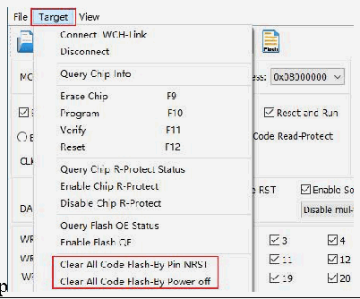
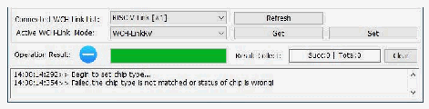

<!-- source-page: 27 -->

[← p.26](0026.md) · [index](../README.md) · [PDF p.27](https://ch32-riscv-ug.github.io/WCH-common/datasheet_en/WCH-LinkUserManual.PDF#page=27) · [p.28 →](0028.md)

<!-- header: WCH-LinkUserManual https://wch-ic.com -->

> ⬆ **Table continued** — rendered in full at [page 26](0026.md). <!-- p27-table-001 -->

 <!-- p27-draw-image-00003 rendered from the PDF -->

 <!-- p27-draw-image-00002 rendered from the PDF -->

<em>Notes:</em>  
- <em>(1) The debugging function is not supported when the user program turns on the sleep function.</em>
- <em>(2) If you exit abnormally when using the debug function, it is recommended to re-plug the Link.</em>
- <em>(3) When using the download and debug functions of CH32F103/CH32F203/CH32V103/CH32V203/</em>
<em>CH32V307/CH32L103/CH32V317/CH32V205_203CC/CH32V407_467, BOOT0 is grounded.</em>  
- <em>(4) When using the debug function of CH569, the user code must be smaller than the configured ROM space,</em>
<em>as shown in Table 2-2 of CH569SD1.</em>  
- <em>(5) When using the debug function of CH32 series chip, please make sure the chip is in the read protection</em>
<em>off state.</em>  
- <em>(6) Typical WCH-Link FAQs can be found at: https://www.wch.cn/bbs/thread-100647-1.html</em>
<!-- image: p27-draw-image-00001 bbox=[508.2, 795.0, 527.28, 805.2] -->
<!-- footer: V2.5 27 -->
