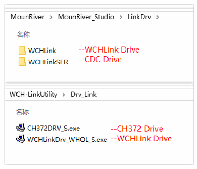
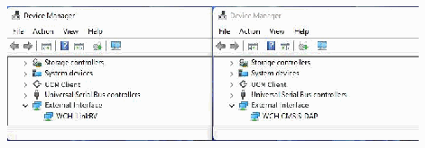
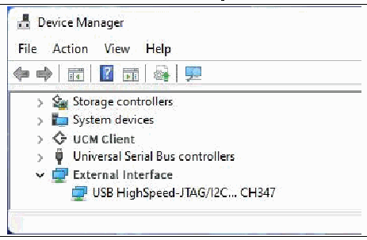

<!-- source-page: 28 -->

[← p.27](0027.md) · [index](../README.md) · [PDF p.28](https://ch32-riscv-ug.github.io/WCH-common/datasheet_en/WCH-LinkUserManual.PDF#page=28) · [p.29 →](0029.md)

<!-- header: WCH-LinkUserManual https://wch-ic.com -->

# 10 Driver Installation

## 10.1 WCH-Link Driver

- (1) The WCH-Link driver will be installed automatically when MounRiver Studio is installed, and the device
manager will be shown in the table below after successful installation. If the driver installation fails, please  
open the LinkDrv folder under the installation path of MounRiver Studio and manually install SETUP.EXE  
under the WCHLink folder.  
- (2) To install the WCH-LinkUtility tool, you need to manually install the WCH-Link driver. Please open the
Drv_Link folder in the WCH-LinkUtility tool file directory and manually install  
WCHLinkDrv_WHQL_S.exe.  

<!-- p28-table-001 (unlabelled-p28-1) -->
<table><tr><th>Device manager</th><th>Drive path</th></tr><tr><td></td><td></td></tr></table>

 <!-- p28-draw-image-00003 rendered from the PDF -->

 <!-- p28-draw-image-00002 rendered from the PDF -->

## 10.2 WCH-LinkE High-speed JTAG Driver

WCH-LinkE-R0-1v3 is upgraded to high-speed JTAG mode, you need to manually install the WCH-LinkE  
high-speed JTAG driver to use it properly. Please open the Drv folder under the installation path of  
WCHLinkEJtagUpdTool and install CH341PAR.EXE manually.  

<!-- p28-table-002 (unlabelled-p28-2) -->
<table><tr><th>Device manager</th><th>Drive path</th></tr><tr><td></td><td></td></tr></table>

 <!-- p28-draw-image-00004 rendered from the PDF -->

 <!-- p28-draw-image-00005 rendered from the PDF -->

## 10.3 CDC Driver

CDC device installation problems under WIN7.  
① If the serial port driver is successfully installed, the following steps are not required.  
② Confirm that the usbser.sys file is present in path B. If it is missing, copy it from path A to path B.  
③ Reinstall the CDC driver. (See the above table for the driver path, please install the CDC driver in the  
corresponding mode)  
<!-- image: p28-draw-image-00001 bbox=[508.2, 795.0, 527.28, 805.2] -->
<!-- footer: V2.5 28 -->
