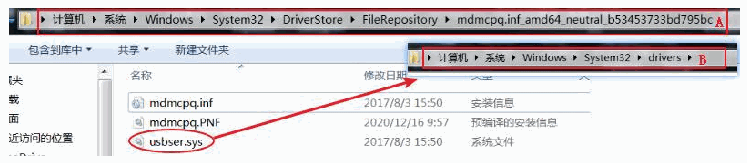
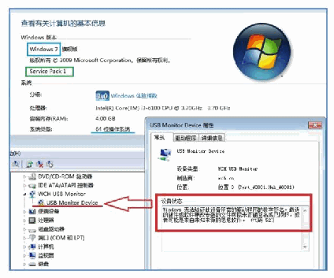

<!-- source-page: 29 -->

[← p.28](0028.md) · [index](../README.md) · [PDF p.29](https://ch32-riscv-ug.github.io/WCH-common/datasheet_en/WCH-LinkUserManual.PDF#page=29)

<!-- header: WCH-LinkUserManual https://wch-ic.com -->

 <!-- p29-draw-image-00002 rendered from the PDF -->

<em>Note: If the above steps do not solve the problem, please refer to the link below</em>  

 <!-- p29-draw-image-00003 rendered from the PDF -->

Reference: http://www.wch.cn/downloads/InstallNoteOn64BitWIN7_ZH_PDF.html  
<!-- image: p29-draw-image-00001 bbox=[508.2, 795.0, 527.28, 805.2] -->
<!-- footer: V2.5 29 -->
