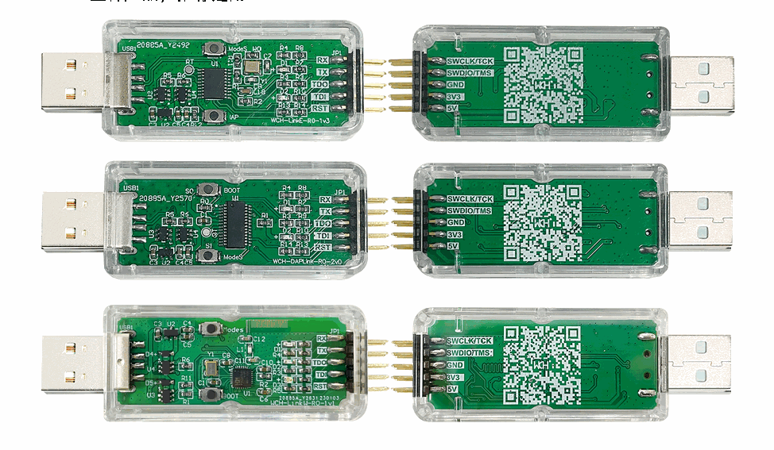
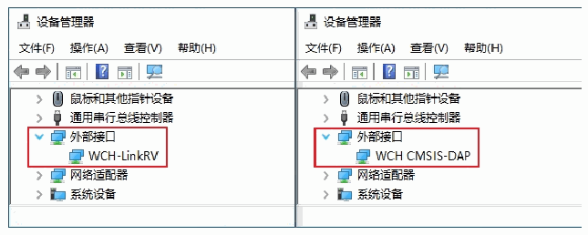

<!-- source-page: 1 -->

[index](../README.md) · [PDF p.1](https://ch32-riscv-ug.github.io/WCH-common/datasheet_zh/WCH-LinkUserManual.PDF#page=1) · [p.2 →](0002.md)

<!-- header: WCH-Link使用说明 https://wch.cn -->

# WCH-Link 使用说明

版本：V2.8  
https://wch.cn  

# 1 WCH-Link

## 1.1 模块简介

WCH-Link模块可用于沁恒RISC-V架构MCU在线调试和下载，也可用于带有SWD/JTAG接口的ARM  
内核MCU的在线调试和下载。同时带有一路串口，方便调试输出。目前有WCH-LinkE、WCH-DAPLink和  
WCH-LinkW三种产品，推荐选用WCH-LinkE。  

 <!-- p1-draw-image-00002 rendered from the PDF -->

图一 WCH-Link实物图  

 <!-- p1-draw-image-00003 rendered from the PDF -->

图二 WCH-Link模式  
<!-- image: p1-draw-image-00001 bbox=[507.6, 786.24, 527.04, 796.8] -->
<!-- footer: V2.8 1 -->
