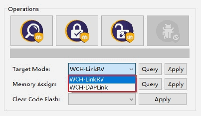
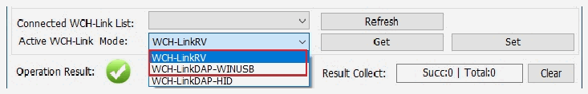

<!-- source-page: 2 -->

[← p.1](0001.md) · [index](../README.md) · [PDF p.2](https://ch32-riscv-ug.github.io/WCH-common/datasheet_zh/WCH-LinkUserManual.PDF#page=2) · [p.3 →](0003.md)

<!-- header: WCH-Link使用说明 https://wch.cn -->
表一 WCH-Link模式  

<!-- p2-table-001 (unlabelled-p2-1) -->
<table><tr><th>模式</th><th>状态指示灯</th><th>IDE</th><th>支持芯片</th></tr><tr><td>RISC-V</td><td>空闲时蓝灯常灭</td><td>MounRiver Studio</td><td>本公司支持单/双线调试的RISC-V核芯片</td></tr><tr><td>ARM</td><td>空闲时蓝灯常亮</td><td>Keil/MounRiver Studio</td><td>支持SWD/JTAG接口的ARM核芯片</td></tr></table>

## 1.2 模式切换

方式一：使用 MounRiver Studio 软件切换 Link模式（该方式适用于 WCH-Link、WCH-LinkE和 WCH-  
LinkW）  
<!-- image: p2-draw-image-00002 bbox=[178.32, 189.72, 208.92, 205.44] -->
① 点击快捷工具栏中的 箭头，弹出工程下载配置窗口  
② 点击Target Mode右侧Query,查看当前Link模式  
③ 点击Target Mode选项框，选择目标Link模式，点击Apply  

 <!-- p2-draw-image-00003 rendered from the PDF -->

方式二：使用WCH-LinkUtility工具切换Link模式  
① 点击Active WCH-Link Mode右侧Get，查看当前Link模式  
② 点击Active WCH-Link Mode选项框，选择目标Link模式，点击Set  

 <!-- p2-draw-image-00004 rendered from the PDF -->

方式三：使用 ModeS 键切换 Link 模式（该方式适用于 WCH-LinkE-R0-1v2、WCH-DAPLink-R0-2v0 和  
WCH-LinkW-R0-1v1及以上版本）  
① 长按ModeS键后将Link上电  
注：  
（1）下载和调试时，蓝灯闪烁。  
（2）后续使用时，Link保持切换后的模式。  
（3）扫描Link背面二维码，即可打开WCH-Link仿真调试器模块网址。  
（4）WCH-Link仿真调试器模块网址：https://www.wch.cn/products/WCH-Link.html  
（5）MounRiver Studio获取网址：https://mounriver.com/  
（6）WCH-LinkUtility获取网址：https://www.wch.cn/downloads/WCH-LinkUtility_ZIP.html  
（7）WCHISPStudio获取网址：https://www.wch.cn/downloads/WCHISPTool_Setup_exe.html  
（8）WCH-Link、WCH-LinkE和WCH-LinkW支持LinkRV和LinkDAP-WINUSB模式切换；WCH-DAPLink支  
持LinkDAP-WINUSB和LinKDAP-HID模式切换。  

## 1.3 串口波特率

表二 WCH-Link串口支持波特率  

<!-- p2-table-002 (unlabelled-p2-2) pages 2-3 -->
<table><tr><th>1200</th><th>2400</th><th>4800</th><th>9600</th><th>14400</th></tr><tr><td>19200</td><td>38400</td><td>57600</td><td>115200</td><td>230400</td></tr></table>

<!-- image: p2-draw-image-00001 bbox=[507.6, 786.24, 527.04, 796.8] -->
<!-- footer: V2.8 2 -->
