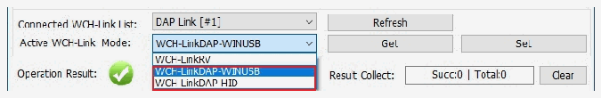

<!-- source-page: 5 -->

[← p.4](0004.md) · [index](../README.md) · [PDF p.5](https://ch32-riscv-ug.github.io/WCH-common/datasheet_zh/WCH-LinkUserManual.PDF#page=5) · [p.6 →](0006.md)

<!-- header: WCH-Link使用说明 https://wch.cn -->

> ⬆ **Table continued** — rendered in full at [page 4](0004.md). <!-- p5-table-001 -->

注：  
（1） 其中 CH564、CH32M030、CH584_585_581、CH570_572、CH32V002_004_005_006_007，  
CH32V205_203CC，CH32H417_415_416，CH595_596，CH32V407_467，CH32X305_315，CH587_586  
和CH32M007支持单线（SWDIO）和两线（SWDIO-SWCLK）调试接口。  
（2） WCH-Link-R1-1v1已停产，官方依然维护，但不再新增功能。  
表七 STM32F10xxx JTAG接口引脚连接  

<!-- p5-table-002 (unlabelled-p5-2) -->
<table><tr><th>JTAG接口引脚名称</th><th>JTAG调试接口</th><th>引脚分配</th></tr><tr><td>TMS</td><td>JTAG模式选择</td><td>PA13</td></tr><tr><td>TCK</td><td>JTAG时钟</td><td>PA14</td></tr><tr><td>TDI</td><td>JTAG数据输入</td><td>PA15</td></tr><tr><td>TDO</td><td>JTAG数据输出</td><td>PB3</td></tr></table>

注：  
（1）Link最大支持线长：30cm，如下载过程不稳定，可尝试将下载速度调低。  
（2）JTAG模式，WCH-LinkE-R0-1v3、WCH-DAPLink-R0-2v0硬件版本开始支持，之前硬件版本不支持。  
（3）WCH-LinkE高速版本仅针对CH32F20x/CH32V20x/CH32V30x进行提速。  
（4）CH569、CH579、CH573、CH583、CH59x、CH584_585_581，若要使用Link进行下载或调试，需使  
用官方ISP工具开启两线调试接口，使用时需注意Link模式。步骤如下：  
● 打开WCHISPStudio工具，待测芯片进入BOOT模式  
·CH569需短接HD0和GND，通过U口上电；  
·CH573/CH583/CH59x/CH584_585_581需长按Download键，通过U口上电；  
● WCHISPStudio工具会自动弹出适配窗口，点击开启两线调试接口  

# 3 Keil 下载与调试

## 3.1 设备切换

WCH-DAPLink支持ARM模式-WINUSB设备和ARM模式-HID设备两种模式，可通过WCH-LinkUtility  
工具（或长按ModeS键后将Link上电）切换两种设备模式。WCH-Link、WCH-LinkE和WCH-LinkW仅支  
持ARM模式-WINUSB设备模式。  

 <!-- p5-draw-image-00002 rendered from the PDF -->

表八 WCH-DAPLink设备  

<!-- p5-table-003 (unlabelled-p5-3) pages 5-6 -->
<table><tr><th>设备</th><th>支持Link</th><th>Keil支持版本</th></tr><tr><td>ARM模式-WINUSB设备</td><td style="text-align:left">WCH-Link WCH-LinkEWCH-DAPLink WCH-LinkW</td><td style="text-align:left">Keil V5.25及以上版本 ARM-CMSIS V5.3.0及以上版本</td></tr><tr><td>ARM模式-HID设备</td><td>WCH-DAPLink</td><td>所有版本Keil都支持</td></tr></table>

<!-- image: p5-draw-image-00001 bbox=[507.6, 786.24, 527.04, 796.8] -->
<!-- footer: V2.8 5 -->
