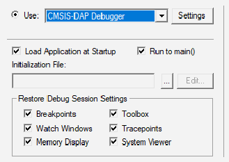
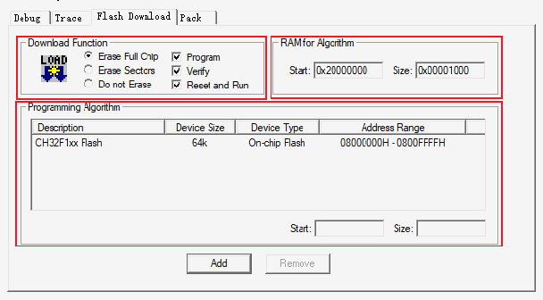

<!-- source-page: 6 -->

[← p.5](0005.md) · [index](../README.md) · [PDF p.6](https://ch32-riscv-ug.github.io/WCH-common/datasheet_zh/WCH-LinkUserManual.PDF#page=6) · [p.7 →](0007.md)

<!-- header: WCH-Link使用说明 https://wch.cn -->

> ⬆ **Table continued** — rendered in full at [page 5](0005.md). <!-- p6-table-001 -->

注：  
（1）WCH-Link、WCH-LinkE、WCH-DAPLink和WCH-LinkW出厂默认为WINUSB设备模式。  
（2）WCH-DAPLink-R0-1v0通过长按IAP键上电切换两种设备模式。  
（3）WCH-LinkUtility工具开启会占用Link设备，导致Keil软件无法识别到Link。  

## 3.2 下载配置

<!-- image: p6-draw-image-00002 bbox=[157.32, 190.32, 178.2, 203.76] -->
① 点击工具栏中的 魔法棒，弹出Options for Target对话框，点击Debug，选择仿真器型号  

 <!-- p6-draw-image-00003 rendered from the PDF -->

② 点击Use选项框，选择CMSIS-DAP Debugger  
③ 点击Settings按钮，弹出Cortex-M Target Driver Setup对话框  

 <!-- p6-draw-image-00004 rendered from the PDF -->

Serial No：显示正在使用的调试适配器的标识符，当连接多个适配器时，可通过下拉列表来指  
定适配器。  
SW Device：显示连接设备的设备ID和名称。  
Port：设置内部调试接口SW或JTAG。（WCH-LinkE-R0-1v3、WCH-DAPLink-R0-2v0和WCH-LinkW-  
R0-1v1两种接口都支持）  
Max Clock：设置与目标设备通信的时钟速率。  
④ 点击Flash Download，进行下载配置  

 <!-- p6-draw-image-00005 rendered from the PDF -->

Download Function：配置选项  
<!-- image: p6-draw-image-00001 bbox=[507.6, 786.24, 527.04, 796.8] -->
<!-- footer: V2.8 6 -->
