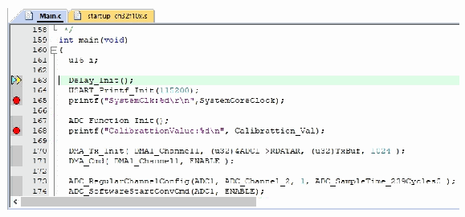

<!-- source-page: 7 -->

[← p.6](0006.md) · [index](../README.md) · [PDF p.7](https://ch32-riscv-ug.github.io/WCH-common/datasheet_zh/WCH-LinkUserManual.PDF#page=7) · [p.8 →](0008.md)

<!-- header: WCH-Link使用说明 https://wch.cn -->
● Erase Full Chip：全片擦除  
● Erase Sectors：部分擦除  
● Do not Erase：不擦除  
● Program：编程  
● Verify：校验  
● Reset and Run：复位后运行  
RAM for Algorithm：配置RAM空间的起始地址和大小  
我司CH32F103系列芯片RAM空间大小为0x1000，CH32F20x系列芯片RAM空间大小为0x2800。  
Programming Algorithm：添加算法文件  
算法文件在安装芯片器件包之后已经自动添加，点击OK即可。  
<!-- image: p7-draw-image-00002 bbox=[348.96, 220.08, 366.84, 233.52] -->
⑤ 完成上述配置后，点击OK，关闭对话框。点击工具栏中的 图标，即可进行代码烧录  

## 3.3 调试

<!-- image: p7-draw-image-00003 bbox=[157.32, 280.92, 175.2, 297.36] -->
① 点击工具栏中的 调试按钮，进入调试页面  
② 设置断点  

 <!-- p7-draw-image-00004 rendered from the PDF -->

③ 基本调试指令  
<!-- image: p7-draw-image-00005 bbox=[89.04, 468.84, 107.76, 483.84] -->
复位：对程序进行复位操作。  
<!-- image: p7-draw-image-00006 bbox=[89.04, 500.04, 107.76, 515.04] -->
全速运行：使当前程序开始全速运行，直到程序遇到断点时停止。  
<!-- image: p7-draw-image-00007 bbox=[89.04, 531.24, 107.76, 546.24] -->
单步跳入调试：执行单条语句，如果遇到函数，则会进入函数内部。  
<!-- image: p7-draw-image-00008 bbox=[89.04, 562.44, 107.76, 577.44] -->
单步跳过调试：执行单条语句，遇到函数不会进入函数内部，而是全速运行函数，并跳到下  
一条语句。  
<!-- image: p7-draw-image-00009 bbox=[89.04, 609.24, 107.76, 624.24] -->
单步返回调试：全速运行当前函数后面所有内容，直到函数返回上一级。  
<!-- image: p7-draw-image-00010 bbox=[178.32, 639.72, 196.2, 656.16] -->
④ 再次点击工具栏中的 调试按钮，退出调试  

# 4 MounRiver Studio 下载与调试

## 4.1 下载配置

① 点击工具栏中的 箭头，弹出工程下载配置窗口  
② 点击Disable Read-Protect按钮，解除芯片读保护  
<!-- image: p7-draw-image-00001 bbox=[507.6, 786.24, 527.04, 796.8] -->
<!-- footer: V2.8 7 -->
