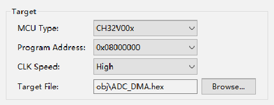

<!-- source-page: 8 -->

[← p.7](0007.md) · [index](../README.md) · [PDF p.8](https://ch32-riscv-ug.github.io/WCH-common/datasheet_zh/WCH-LinkUserManual.PDF#page=8) · [p.9 →](0009.md)

<!-- header: WCH-Link使用说明 https://wch.cn -->
<!-- image: p8-draw-image-00002 bbox=[191.16, 60.36, 404.04, 99.84] -->
③ 目标配置，主要内容如下：  

 <!-- p8-draw-image-00003 rendered from the PDF -->

MCU Type：芯片型号  
Program Address：编程地址  
CLK Speed：两线调试速度  
Target File：目标文件  
④ 配置选项  
<!-- image: p8-draw-image-00004 bbox=[188.88, 294.0, 405.96, 318.6] -->
Erase All：全片擦除  
Program：编程  
Verify：校验  
Reset and run：复位后运行  
<!-- image: p8-draw-image-00005 bbox=[342.0, 389.76, 359.28, 406.92] -->
⑤ 点击Apply and Close，保存下载配置。点击工具栏中的 图标，即可进行代码烧录，结果显示  
在Console中  

## 4.2 调试

① 进入调试页面  
<!-- image: p8-draw-image-00006 bbox=[204.6, 484.44, 223.2, 499.44] -->
方式一：点击工具栏中的 调试按钮，直接进入调试页面。  
方式二：点击工具栏中的 箭头，选择Debug Configurations，弹出调试配置页面。双击GDB  
OpenOCD MRS Debugging，生成obj文件，选择obj文件，点击右下角Debug按钮，进入调试页面。  
<!-- image: p8-draw-image-00001 bbox=[507.6, 786.24, 527.04, 796.8] -->
<!-- footer: V2.8 8 -->
