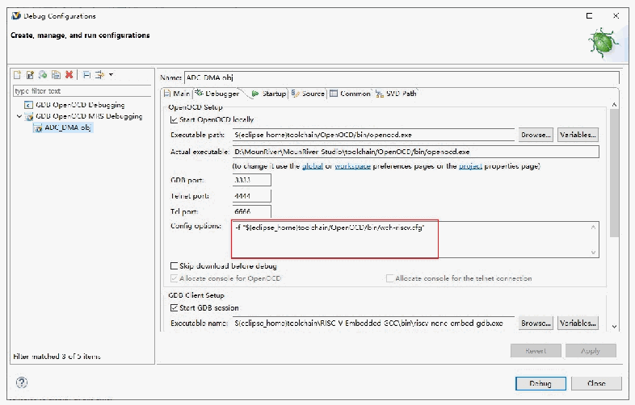
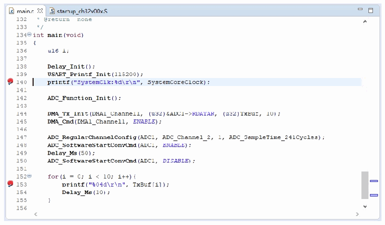

<!-- source-page: 9 -->

[← p.8](0008.md) · [index](../README.md) · [PDF p.9](https://ch32-riscv-ug.github.io/WCH-common/datasheet_zh/WCH-LinkUserManual.PDF#page=9) · [p.10 →](0010.md)

<!-- header: WCH-Link使用说明 https://wch.cn -->

 <!-- p9-draw-image-00002 rendered from the PDF -->

② 设置断点  

 <!-- p9-draw-image-00003 rendered from the PDF -->

③ 基本调试指令  
<!-- image: p9-draw-image-00004 bbox=[89.04, 562.44, 107.76, 577.44] -->
复位：对程序进行复位操作。  
<!-- image: p9-draw-image-00005 bbox=[89.04, 593.64, 107.76, 608.64] -->
全速运行：使当前程序开始全速运行，直到程序遇到断点时停止。  
<!-- image: p9-draw-image-00006 bbox=[89.04, 624.84, 107.76, 639.84] -->
终止调试：退出调试。  
<!-- image: p9-draw-image-00007 bbox=[89.04, 656.04, 107.76, 671.04] -->
单步跳入调试：执行单条语句，如果遇到函数，则会进入函数内部。  
<!-- image: p9-draw-image-00008 bbox=[89.04, 687.24, 107.76, 702.24] -->
单步跳过调试：执行单条语句，遇到函数不会进入函数内部，而是全速运行函数，并跳到下  
一条语句。  
<!-- image: p9-draw-image-00009 bbox=[89.04, 734.04, 107.76, 749.04] -->
单步返回调试：全速运行当前函数后面所有内容，直到函数返回上一级。  
④ 点击 按钮，退出调试  
<!-- image: p9-draw-image-00001 bbox=[507.6, 786.24, 527.04, 796.8] -->
<!-- footer: V2.8 9 -->
