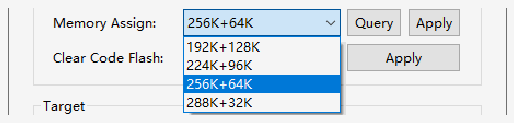

<!-- source-page: 10 -->

[← p.9](0009.md) · [index](../README.md) · [PDF p.10](https://ch32-riscv-ug.github.io/WCH-common/datasheet_zh/WCH-LinkUserManual.PDF#page=10) · [p.11 →](0011.md)

<!-- header: WCH-Link使用说明 https://wch.cn -->

## 4.3 其他功能

### 4.3.1 设置芯片读保护

<!-- image: p10-draw-image-00002 bbox=[89.04, 106.8, 117.96, 128.28] -->
查询芯片读保护状态  
<!-- image: p10-draw-image-00003 bbox=[89.04, 138.0, 117.96, 159.48] -->
使能芯片读保护状态  
<!-- image: p10-draw-image-00004 bbox=[89.04, 169.2, 117.96, 190.68] -->
解除芯片读保护状态  

### 4.3.2 Code Flash 全擦

MounRiver Studio 可以通过控制硬件复位引脚或重新上电对芯片的用户区进行全部擦除。通过  
重新上电控制擦除，需使用Link为芯片供电；通过硬件复位引脚控制擦除，需连接芯片与Link的复  
位引脚。（仅WCH-LinkE、WCH-DAPLink和WCH-LinkW支持）  
<!-- image: p10-draw-image-00005 bbox=[196.08, 276.24, 399.24, 305.16] -->

### 4.3.3 关闭两线调试接口

针对部分芯片，可通过关闭两线调试接口，开启代码和数据保护。  
<!-- image: p10-draw-image-00006 bbox=[89.04, 356.4, 117.96, 377.88] -->
禁止两线调试接口  

### 4.3.4 芯片内存分配

针对大容量通用型（连接型/互联型/无线型）芯片，可通过MounRiver Studio进行内存分配，  
详情请参考CH32FV2x_V3xRM手册的用户选择字章节。  

 <!-- p10-draw-image-00007 rendered from the PDF -->

# 5 WCH-LinkUtility 下载

## 5.1 下载配置

<!-- image: p10-draw-image-00008 bbox=[104.76, 574.8, 129.96, 596.28] -->
① 点击 图标，连接Link  
② 选择芯片型号  
<!-- image: p10-draw-image-00009 bbox=[179.88, 620.4, 415.08, 646.8] -->
③ 配置选项  
<!-- image: p10-draw-image-00010 bbox=[180.48, 670.08, 414.72, 691.32] -->
Erase All：全片擦除  
Program：编程  
Verify：校验  
Reset and run：复位后运行  
④ 解除芯片读保护，设置两线调试速度  
<!-- image: p10-draw-image-00001 bbox=[507.6, 786.24, 527.04, 796.8] -->
<!-- footer: V2.8 10 -->
