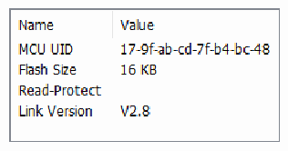
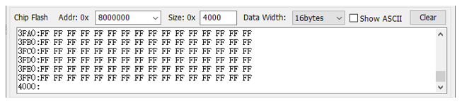

<!-- source-page: 11 -->

[← p.10](0010.md) · [index](../README.md) · [PDF p.11](https://ch32-riscv-ug.github.io/WCH-common/datasheet_zh/WCH-LinkUserManual.PDF#page=11) · [p.12 →](0012.md)

<!-- header: WCH-Link使用说明 https://wch.cn -->
<!-- image: p11-draw-image-00002 bbox=[179.16, 63.24, 415.92, 96.96] -->
<!-- image: p11-draw-image-00003 bbox=[104.76, 106.8, 127.44, 128.28] -->
⑤ 点击 图标，添加固件  
<!-- image: p11-draw-image-00004 bbox=[104.76, 138.24, 129.96, 159.24] -->
⑥ 点击 图标，执行下载  

## 5.2 其他功能

### 5.2.1 查询芯片信息

<!-- image: p11-draw-image-00005 bbox=[110.04, 216.24, 132.72, 237.24] -->
点击 图标，查询芯片信息  

 <!-- p11-draw-image-00006 rendered from the PDF -->

MCU UID：芯片ID  
Flash Size：芯片Flash大小  
Read-Protect：芯片读保护状态  
Link Version：Link固件版本  

### 5.2.2 设置芯片读保护

<!-- image: p11-draw-image-00007 bbox=[89.04, 419.04, 114.24, 440.04] -->
查询芯片读保护状态  
<!-- image: p11-draw-image-00008 bbox=[89.04, 450.24, 114.24, 471.24] -->
使能芯片读保护状态  
<!-- image: p11-draw-image-00009 bbox=[89.04, 481.44, 114.24, 502.44] -->
解除芯片读保护状态  

### 5.2.3 读取芯片 Flash

<!-- image: p11-draw-image-00010 bbox=[110.04, 543.84, 135.24, 564.84] -->
点击 图标，读取芯片Flash  

 <!-- p11-draw-image-00011 rendered from the PDF -->

### 5.2.4 Code Flash 全擦

WCH-LinkUtility工具可以通过控制硬件复位引脚或重新上电对芯片的用户区进行全部擦除。通  
过重新上电控制擦除，需使用Link为芯片供电；通过硬件复位引脚控制擦除，需连接芯片与Link的  
复位引脚。（仅WCH-LinkE、WCH-DAPLink和WCH-LinkW支持）  
<!-- image: p11-draw-image-00001 bbox=[507.6, 786.24, 527.04, 796.8] -->
<!-- footer: V2.8 11 -->
