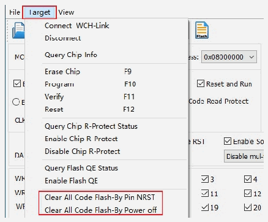
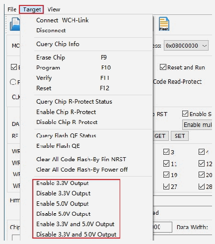
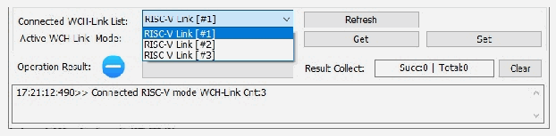

<!-- source-page: 12 -->

[← p.11](0011.md) · [index](../README.md) · [PDF p.12](https://ch32-riscv-ug.github.io/WCH-common/datasheet_zh/WCH-LinkUserManual.PDF#page=12) · [p.13 →](0013.md)

<!-- header: WCH-Link使用说明 https://wch.cn -->

 <!-- p12-draw-image-00002 rendered from the PDF -->

### 5.2.5 电源输出可控

WCH-LinkUtility工具可控制Link电源输出。点击Target，在下拉列表中可选择开启/关闭电源  
3.3V/5V输出。（仅WCH-LinkE、WCH-DAPLink和WCH-LinkW支持）  

 <!-- p12-draw-image-00003 rendered from the PDF -->

### 5.2.6 自动连续下载

勾选Auto download when WCH-Link was linked，可实现工程自动连续下载。  
<!-- image: p12-draw-image-00004 bbox=[112.32, 573.36, 482.4, 600.84] -->

### 5.2.7 多设备下载

WCH-LinkUtility 工具可以识别多个 Link 设备。当连接多个 Link 时，可通过 Connected WCH-  
Link List选项框选择指定Link设备进行下载。  

 <!-- p12-draw-image-00005 rendered from the PDF -->

### 5.2.8 关闭两线调试接口

<!-- image: p12-draw-image-00001 bbox=[507.6, 786.24, 527.04, 796.8] -->
<!-- footer: V2.8 12 -->
