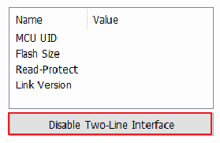
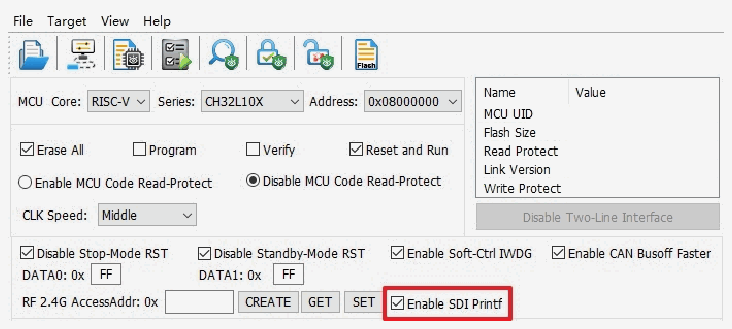

<!-- source-page: 13 -->

[← p.12](0012.md) · [index](../README.md) · [PDF p.13](https://ch32-riscv-ug.github.io/WCH-common/datasheet_zh/WCH-LinkUserManual.PDF#page=13) · [p.14 →](0014.md)

<!-- header: WCH-Link使用说明 https://wch.cn -->
针对部分芯片，可通过关闭两线调试接口，开启代码和数据保护。  

 <!-- p13-draw-image-00002 rendered from the PDF -->

### 5.2.9 用户选择字配置

针对CH32系列芯片，可通过WCH-LinkUtility工具进行用户选择字配置，详情请参考芯片RM手  
册的用户选择字章节。  
<!-- image: p13-draw-image-00003 bbox=[181.08, 235.68, 414.0, 251.52] -->

 <!-- p13-draw-image-00004 rendered from the PDF -->

### 5.2.10 BOOT 下载

针对 CH32V003、CH641、CH32V002_004_005_006_007、CH32M007、CH32X035_X033 芯片，可通过  
WCH-LinkUtility工具选择程序下载到程序闪存存储区或系统存储区。  
<!-- image: p13-draw-image-00005 bbox=[163.68, 419.04, 431.4, 458.76] -->

### 5.2.11 SDI 虚拟串口功能

该功能使用 SDI 接口，实现芯片打印输出功能，该功能需修改打印函数，具体参考相关 EVT 中  
SDI_Printf例程。该功能仅V1.80及以上版本支持，使用时需勾选Enable SDI Printf,且打开WCH-  
LinkE的COM口。  

 <!-- p13-draw-image-00006 rendered from the PDF -->

注：  
（1） 该功能仅V1.80及以上版本支持。  
（2） 该功能仅WCH-LinkE支持。  
（3） 该功能支持芯片包括CH32V003、CH32V103、CH32V20x、CH32V30x、CH32X035_X033、CH32L103、  
CH641、CH32V002_004_005_006_007、CH32M007、CH32M030、CH32V317，CH32V205_203CC、  
CH32V407_467、CH32X305_315。  
<!-- image: p13-draw-image-00001 bbox=[507.6, 786.24, 527.04, 796.8] -->
<!-- footer: V2.8 13 -->
