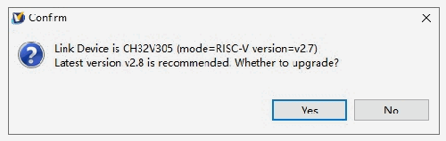
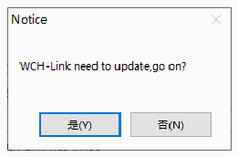
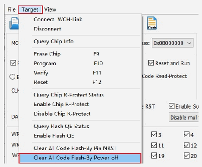

<!-- source-page: 14 -->

[← p.13](0013.md) · [index](../README.md) · [PDF p.14](https://ch32-riscv-ug.github.io/WCH-common/datasheet_zh/WCH-LinkUserManual.PDF#page=14) · [p.15 →](0015.md)

<!-- header: WCH-Link使用说明 https://wch.cn -->

# 6 固件更新方式

## 6.1 MounRiver Studio 在线更新

若固件需升级，点击下载按钮时MounRiver Studio会有弹窗提醒，点击Yes启动更新。  

 <!-- p14-draw-image-00002 rendered from the PDF -->

## 6.2 WCH-LinkUtility 在线更新

若固件需升级，点击下载按钮时WCH-LinkUtility会有弹窗提醒，点击Yes启动更新。  

 <!-- p14-draw-image-00003 rendered from the PDF -->

注：  
（1）WCH-LinkE支持手动在线更新，步骤如下：  
● 长按IAP键后将Link上电，直至蓝灯闪烁；  
● 点击下载按钮时MounRiver Studio/WCH-LinkUtility会有弹窗提醒，点击Yes启动更新。  
（2）若Link固件更新异常，请通过离线更新方式更新固件。  

## 6.3 WCH-LinkUtility 离线更新（两线方式离线更新）

① 连接WCH-LinkE与待更新WCH-LinkE  

<!-- p14-table-001 (unlabelled-p14-1) -->
<table><tr><th>WCH-LinkE</th><th>待更新WCH-LinkE</th></tr><tr><td>3V3</td><td>3V3</td></tr><tr><td>GND</td><td>GND</td></tr><tr><td>SWDIO</td><td>SWDIO</td></tr><tr><td>SWCLK</td><td>SWCLK</td></tr></table>

② WCH-LinkE上电，选择待更新Link芯片型号（WCH-LinkE主控芯片为CH32V30x）  
③ 待更新Link进入IAP模式（长按IAP键后将Link上电，即通过USB口连接电脑上电）  
④ 点击Target-&gt;Clear All Code Flash-By Power off，对芯片的用户区进行全部擦除  

 <!-- p14-draw-image-00004 rendered from the PDF -->

⑤ 点击 图标，解除芯片读保护  
<!-- image: p14-draw-image-00001 bbox=[507.6, 786.24, 527.04, 796.8] -->
<!-- footer: V2.8 14 -->
