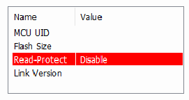
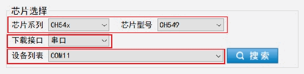
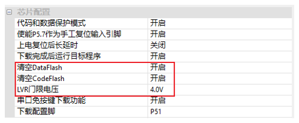

<!-- source-page: 15 -->

[← p.14](0014.md) · [index](../README.md) · [PDF p.15](https://ch32-riscv-ug.github.io/WCH-common/datasheet_zh/WCH-LinkUserManual.PDF#page=15) · [p.16 →](0016.md)

<!-- header: WCH-Link使用说明 https://wch.cn -->

 <!-- p15-draw-image-00002 rendered from the PDF -->

<!-- image: p15-draw-image-00003 bbox=[104.76, 122.4, 127.44, 143.88] -->
⑥ 点击 图标，添加Link离线升级固件  
⑦ 配置选项（编程+校验+复位）  
<!-- image: p15-draw-image-00004 bbox=[183.6, 171.0, 411.12, 191.64] -->
<!-- image: p15-draw-image-00005 bbox=[104.76, 200.64, 129.96, 221.64] -->
⑧ 点击 图标，执行下载  
注：  
（1）两线方式离线更新仅WCH-LinkE支持。  
（2）该方式需要有两个WCH-LinkE。  
（3）Link进入IAP模式时，蓝灯闪烁。  

## 6.4 WCHISPStudio 串口离线更新

① 连接WCH-Link与USB转TTL模块  

<!-- p15-table-001 (unlabelled-p15-1) -->
<table><tr><th>WCH-Link</th><th>USB转TTL模块</th></tr><tr><td>TX</td><td>RX</td></tr><tr><td>RX</td><td>TX</td></tr><tr><td>GND</td><td>GND</td></tr></table>

② USB转TTL模块上电，WCH-Link进入BOOT模式（短接图一中J1将Link上电）  
③ 选择芯片型号：CH549，下载接口：串口，设备列表：选择USB转TTL模块对应的串口号  

 <!-- p15-draw-image-00006 rendered from the PDF -->

④ 添加Link离线升级固件至目标程序文件  
⑤ 下载配置  

 <!-- p15-draw-image-00007 rendered from the PDF -->

⑥ 点击下载按钮  
⑦ 点击下载后出现等待设备接入字段，此时将WCH-Link插上USB接口，ISP工具自动开始下载  
注：串口离线更新仅WCH-Link支持。  

## 6.5 WCHISPStudio USB 离线更新

① 待更新Link进入BOOT模式（短接图一中J1或长按BOOT键后将Link上电）  
② WCHISPStudio工具会自动弹出适配窗口  
③ 添加Link离线升级固件至目标程序文件  
④ 下载配置  
<!-- image: p15-draw-image-00001 bbox=[507.6, 786.24, 527.04, 796.8] -->
<!-- footer: V2.8 15 -->
