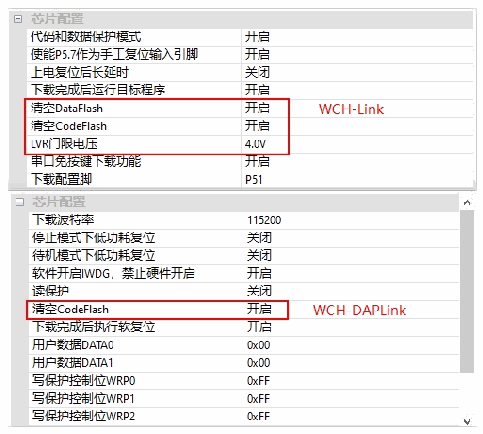
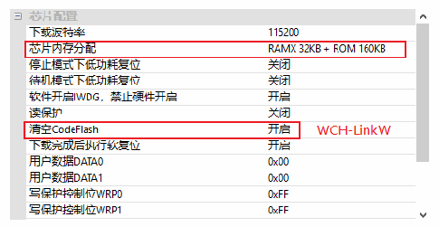
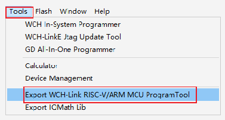

<!-- source-page: 16 -->

[← p.15](0015.md) · [index](../README.md) · [PDF p.16](https://ch32-riscv-ug.github.io/WCH-common/datasheet_zh/WCH-LinkUserManual.PDF#page=16) · [p.17 →](0017.md)

<!-- header: WCH-Link使用说明 https://wch.cn -->

 <!-- p16-draw-image-00002 rendered from the PDF -->

 <!-- p16-draw-image-00003 rendered from the PDF -->

⑤ 点击下载按钮  
注：  
（1）USB离线更新仅WCH-Link、WCH-DAPLink和WCH-LinkW支持。  
（2）WCH-LinkE-R0-1v3和WCH-DAPLink-R0-2v0仅适用固件版本v2.8及以上版本。  
（3）WCH-LinkUtility工具可通过MounRiver Studio软件导出。  

 <!-- p16-draw-image-00004 rendered from the PDF -->

（4）Link离线升级固件位于MounRiver Studio安装路径和WCH-LinkUtility安装路径。  

 <!-- p16-draw-image-00005 rendered from the PDF -->

<!-- image: p16-draw-image-00001 bbox=[507.6, 786.24, 527.04, 796.8] -->
<!-- footer: V2.8 16 -->
