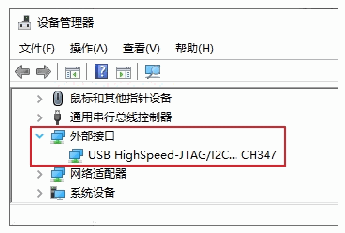
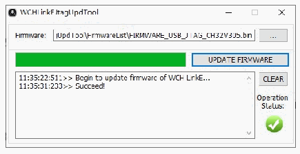

<!-- source-page: 17 -->

[← p.16](0016.md) · [index](../README.md) · [PDF p.17](https://ch32-riscv-ug.github.io/WCH-common/datasheet_zh/WCH-LinkUserManual.PDF#page=17) · [p.18 →](0018.md)

<!-- header: WCH-Link使用说明 https://wch.cn -->
① WCH-DAPLink升级固件  
② WCH-LinkW升级固件  
③ WCH-LinkE升级固件  
④ WCH-Link RISC-V模式升级固件  
⑤ WCH-Link ARM模式升级固件  
⑥ WCH-DAPLink离线升级固件  
⑦ WCH-Link ARM模式离线升级固件  
⑧ WCH-Link RISC-V模式离线升级固件  
⑨ WCH-LinkE离线升级固件  
⑩ WCH-LinkW离线升级固件  

# 7 WCH-LinkE 高速 JTAG

## 7.1 模块简介

WCH-LinkE-R0-1v3 提供了一个 JTAG接口，支持四线连接（TMS线，TCK线，TDI线和 TDO线），  
用于为计算机扩展JTAG接口，操作CPU、DSP、FPGA和CPLD等器件。  

 <!-- p17-draw-image-00002 rendered from the PDF -->

图三 WCH-LinkE高速JTAG模式  

## 7.2 模块特点

● 作为Host/Master主机模式。  
● JTAG接口提供TMS线、TCK线、TDI和TDO线。  
● 支持高速USB数据传输。  
● 通过计算机API配合，可灵活操作CPU、DSP、FPGA和CPLD等器件。  

## 7.3 模式切换

可通过 WCHLinkEJtagUpdTool 工具将 WCH-LinkE-R0-1v3 升级为高速 JTAG模式，下载步骤如下：  
① WCH-LinkE-R0-1v3进入IAP模式（长按IAP键后将Link上电，即通过USB口连接电脑上电），  
此时蓝灯闪烁  
② 打开WCHLinkEJtagUpdTool工具，执行下载（WCH-LinkE高速JTAG升级固件已自动添加）  
③ 固件更新完成后，此时蓝灯常亮  

 <!-- p17-draw-image-00003 rendered from the PDF -->

注：  
<em>（1）WCHLinkEJtagUpdTool获取网址：https://www.wch.cn/downloads/WCHLinkEJtagUpdTool_ZIP.html</em>  
<!-- image: p17-draw-image-00001 bbox=[507.6, 786.24, 527.04, 796.8] -->
<!-- footer: V2.8 17 -->
