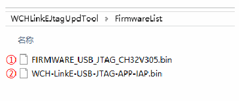

<!-- source-page: 18 -->

[← p.17](0017.md) · [index](../README.md) · [PDF p.18](https://ch32-riscv-ug.github.io/WCH-common/datasheet_zh/WCH-LinkUserManual.PDF#page=18) · [p.19 →](0019.md)

<!-- header: WCH-Link使用说明 https://wch.cn -->
（2）可通过WCH-LinkUtility工具离线更新固件，详情请参考手册6.3 WCH-LinkUtility离线更新。  
（3）WCH-LinkE高速JTAG离线升级固件位于WCHLinkEJtagUpdTool安装路径。  

 <!-- p18-draw-image-00002 rendered from the PDF -->

① WCH-LinkE高速JTAG升级固件  
② WCH-LinkE高速JTAG离线升级固件  

## 7.4 下载流程

① 在WCH-LinkE高速JTAG模式下，通过JTAG先将Bit程序文件下载到FPGA中，Bit文件将操  
作FPGA的SPI控制器，将JTAG数据转换为SPI数据写入Flash，此步骤即将BIN文件写入，从而实  
现其程序固化过程  
② 此处选用 FPGA为 Xilinx 的 xc7a35t。编写 CFG文件，使用“openocd -f”指定来调用。将  
CFG文件命名为usb20jtag.cfg，保存至openocd.exe文件所在位置  
# 指定WCH-LinkE高速JTAG 调试器  
adapter driver ch347  
ch347 vid_pid 0x1a86 0x55dd  
# 设置TCK时钟频率  
adapter speed 10000  
# 指定操作的TARGET，加载OpenOCD中JTAG-SPI驱动  
source [find cpld/xilinx-xc7.cfg]  
source [find cpld/jtagspi.cfg]  
# 设置TARGET的IR命令  
set XC7_JSHUTDOWN 0x0d  
set XC7_JPROGRAM 0x0b  
set XC7_JSTART 0x0c  
set XC7_BYPASS 0x3f  
# 下载流程  
init  
# 先下载Bit文件至TARGET  
pld load 0 bscan_spi_xc7a35t.bit  
reset halt  
# 检测Flash信息  
flash probe 0  
# 下载Bin文件至Flash中  
flash write_image erase test.bin 0x0 bin  
# 生效固件操作  
irscan xc7.tap $XC7_JSHUTDOWN  
<!-- image: p18-draw-image-00001 bbox=[507.6, 786.24, 527.04, 796.8] -->
<!-- footer: V2.8 18 -->
