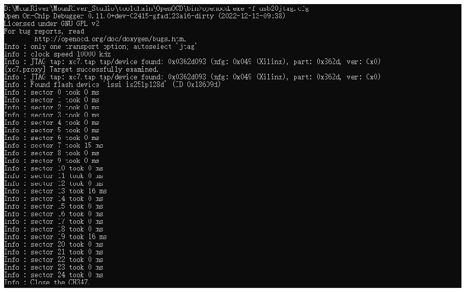

<!-- source-page: 19 -->

[← p.18](0018.md) · [index](../README.md) · [PDF p.19](https://ch32-riscv-ug.github.io/WCH-common/datasheet_zh/WCH-LinkUserManual.PDF#page=19) · [p.20 →](0020.md)

<!-- header: WCH-Link使用说明 https://wch.cn -->
irscan xc7.tap $XC7_JPROGRAM  
runtest 60000  
runtest 2000  
irscan xc7.tap $XC7_BYPASS  
runtest 2000  
exit  
③ 在Windows终端运行命令：openocd.exe -f usb20jtag.cfg，执行如下  

 <!-- p19-draw-image-00002 rendered from the PDF -->

④ 下载结束，设备正常运行  
注：  
<em>（1）转换作用的Bit文件，可借助Github开源项目：https://github.com/quartiq/bscan_spi_bitstreams</em>  
（2）openocd.exe文件所在位置：MounRiver\MounRiver_Studio\toolchain\OpenOCD\bin  

# 8.WCH-LinkW 使用介绍

## 8.1 模块简介

WCH-LinkW 是一款有线/无线 2.4G 双模仿真调试器，可用于沁恒 RISC-V 架构 MCU 在线调试和下  
载，也可用于带有SWD/JTAG接口的ARM芯片在线调试和下载。  

## 8.2 使用方法

### 8.2.1 有线模式

有线模式仅需要1个WCH-LinkW，将排针连接MCU，USB口连接电脑，即可进行下载调试。  
<!-- image: p19-draw-image-00001 bbox=[507.6, 786.24, 527.04, 796.8] -->
<!-- footer: V2.8 19 -->
