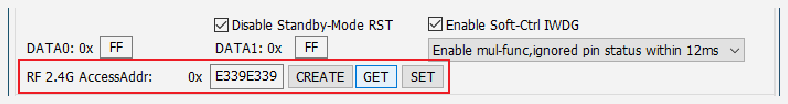

<!-- source-page: 20 -->

[← p.19](0019.md) · [index](../README.md) · [PDF p.20](https://ch32-riscv-ug.github.io/WCH-common/datasheet_zh/WCH-LinkUserManual.PDF#page=20) · [p.21 →](0021.md)

<!-- header: WCH-Link使用说明 https://wch.cn -->
SWCLK/TCK SWCLK  
SWDIO/TMS SWDIO  
PC机 USB口 USB口  
GND GND  
仿真器 目标板  
3V3 3V3  

### 8.2.2 无线模式

无线模式需要2个WCH-LinkW，分为WCH-LinkW主机（连接电脑）和WCH-LinkW从机（连接MCU）。  
WCH-LinkW 连接电脑枚举成功后，在 2 秒内检测是否有从机匹配，来进行模式切换，若匹配到从机，  
则切换至无线模式，此时绿灯点亮；反之，则切换至有线模式，绿灯熄灭。  
无线模式下载调试需要用到2个WCH-LinkW，使用步骤如下：  
① 从机与MCU通过两线方式连接，通过MCU的U口供电，也可通过充电头或移动电源与从机USB  
口连接，对从机和MCU进行供电  
② 待从机上电成功后，主机USB口连接电脑。主机设备枚举成功后，2秒内匹配到从机，则主机  
和从机绿灯点亮  
③ 无线模式主机和从机匹配成功后，主机和从机都断电则需重复上述步骤，若仅 1 个断电，可  
重新上电进行自动匹配，不必重复上述流程  
④ 进行MCU下载调试  
SWCLK/TCK SWCLK  
SWDIO/TMS SWDIO  
从机  
GND GND  
仿真器 目标板  
3V3 3V3  
USB口 USB口 PC机  
主机  
仿真器  
注：使用Code Flash全擦和电源输出可控功能需通过充电头或移动电源与从机USB口连接，对从机  
和MCU进行供电。  

## 8.3 无线模式访问地址匹配

WCH-LinkW使用无线模式进行下载调试时，需保证主机和从机的无线模式访问地址一致。可通过  
WCH-LinkUtility工具设置无线模式访问地址。步骤如下：  

 <!-- p20-draw-image-00002 rendered from the PDF -->

① 分别将 WCH-LinkW 无线模式主机和从机连接电脑，点击 GET 按钮，查询当前主机和从机的访  
问地址是否一致，若一致且不为0xE339E339，执行步骤4，否则执行步骤2  
② 点击CREATE按钮，创建随机地址  
③ 点击SET按钮，分别设置主机和从机的访问地址  
④ 从机连接MCU先上电，之后主机连接电脑，绿灯点亮即可正常使用无线模式  
<!-- image: p20-draw-image-00001 bbox=[507.6, 786.24, 527.04, 796.8] -->
<!-- footer: V2.8 20 -->
