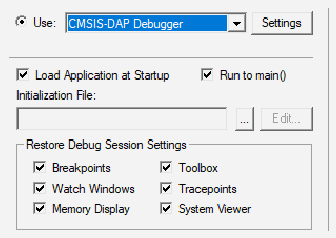
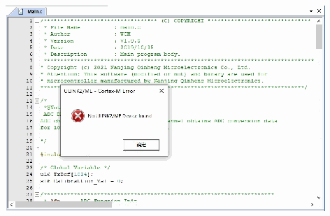
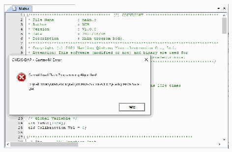
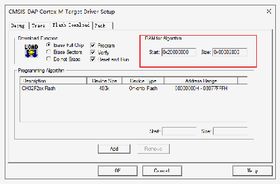
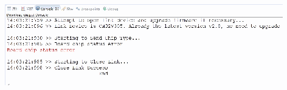

<!-- source-page: 21 -->

[← p.20](0020.md) · [index](../README.md) · [PDF p.21](https://ch32-riscv-ug.github.io/WCH-common/datasheet_zh/WCH-LinkUserManual.PDF#page=21) · [p.22 →](0022.md)

<!-- header: WCH-Link使用说明 https://wch.cn -->
注：  
（1）WCH-LinkW无线模式访问地址出厂默认为0xE339E339。  
（2）无线模式时，同一使用环境下，需保证仅有一对WCH-LinkW无线访问地址一致。若有多对设备，  
需使用上述步骤设置不同的无线模式访问地址。  

# 9 典型问题说明

<!-- p21-table-001 (unlabelled-p21-1) pages 21-22 -->
<table><tr><th>错误提醒</th><th>解决方法</th></tr><tr><td>使用Keil软件下载</td><td>1.请参考手册3.2下载配置完成Keil下载配置。</td></tr><tr><td>使用Keil软件下载</td><td style="text-align:left">1.我司 CH32F20x 系列芯片 RAM 空间大小为0x2800。</td></tr><tr><td>使用MounRiver Studio软件下载</td><td style="text-align:left">1.检查芯片两线调试接口与Link连接是否正确； 2.检查芯片的Debug功能是否开启（若未开启， 可通过ISP工具开启）； 3.检查芯片内用户程序是否开启睡眠功能，是否 有操作 FLASH 相关函数（若开启，可进 BOOT 模式，通过两线下载）； 4.检查芯片内用户程序的两线调试接口是否复用为普通GPIO口（若复用，可进BOOT模式，通过两线下载）。 注： （1）对于CH32系列芯片，若出现下载不成功的情况，可进BOOT模式（BOOT0接VCC、BOOT1接GND），通过Link进行下载。 （2）对于3和4的问题，可通过对芯片的用户 区进行全部擦除解决（具体参考手册4.3.2 Code Flash全擦或5.2.4 Code Flash全擦）。</td></tr><tr><td>使用WCH-LinkUtility工具下载</td><td>对芯片的用户区进行全部擦除</td></tr><tr><td style="text-align:left">使用WCHLinkEJtagUpdTool工具更新固件， 按照手册 7.3 模式切换下载步骤更新固件后， WCH-LinkE-R0-1v3上蓝灯不亮，设备管理器无法识别设备。</td><td style="text-align:left">1.分析原因，可能是 WCH-LinkE-R0-1v3上的Y1晶振焊接异常，导致晶振无法正常起振。因此需重新焊接下Y1晶振。</td></tr><tr><td style="text-align:left">使用WCH-LinkW无线模式进行下载调试时， 绿灯不亮。</td><td>1.请参考手册8.2.2章节进行操作。</td></tr><tr><td style="text-align:left">使用WCH-LinkW无线模式进行下载调试时， Code Flash全擦和电源输出可控功能不可用。</td><td style="text-align:left">1.使用上述功能需通过充电头或移动电源与从机USB口连接，对从机和MCU进行供电。</td></tr><tr><td style="text-align:left">使用WCH-LinkW无线模式进行下载调试时， 从机无法在线升级固件。</td><td style="text-align:left">1.WCH-LinkW 从机在线升级固件需在有线模式下进行。</td></tr></table>

 <!-- p21-draw-image-00003 rendered from the PDF -->

 <!-- p21-draw-image-00002 rendered from the PDF -->

 <!-- p21-draw-image-00004 rendered from the PDF -->

 <!-- p21-draw-image-00005 rendered from the PDF -->

 <!-- p21-draw-image-00006 rendered from the PDF -->

<!-- image: p21-draw-image-00001 bbox=[507.6, 786.24, 527.04, 796.8] -->
<!-- footer: V2.8 21 -->
