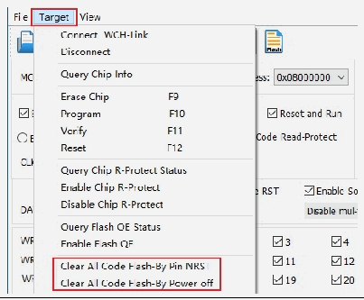
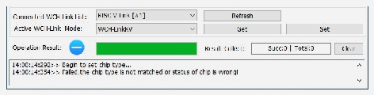

<!-- source-page: 22 -->

[← p.21](0021.md) · [index](../README.md) · [PDF p.22](https://ch32-riscv-ug.github.io/WCH-common/datasheet_zh/WCH-LinkUserManual.PDF#page=22) · [p.23 →](0023.md)

<!-- header: WCH-Link使用说明 https://wch.cn -->

> ⬆ **Table continued** — rendered in full at [page 21](0021.md). <!-- p22-table-001 -->

 <!-- p22-draw-image-00003 rendered from the PDF -->

 <!-- p22-draw-image-00002 rendered from the PDF -->

注：  
（1）用户程序开启睡眠功能时，不支持调试功能。  
（2）若使用debug功能时异常退出，建议重新拔插Link。  
（3）使用CH32F103/CH32F203/CH32V103/CH32V203/CH32V307/CH32L103/CH32V317/CH32V205_203CC  
/CH32V407_467的下载和调试功能时，BOOT0需接地。  
（4）使用CH569的调试功能时，用户代码必须小于配置的ROM空间，具体见CH569DS1手册表2-2。  
（5）使用CH32系列芯片的调试功能时，请确保芯片处于读保护关闭状态。  
（6）WCH-Link典型常见问题可参考：https://www.wch.cn/bbs/thread-100647-1.html  

# 10 驱动安装

## 10.1 WCH-Link 驱动

（1）安装MounRiver Studio时会自动安装WCH-Link驱动，安装成功后设备管理器如下表所示，  
如果驱动安装失败，请打开MounRiver Studio安装路径下的LinkDrv文件夹，手动安装WCHLink文  
件夹下的SETUP.EXE。  
（2）安装WCH-LinkUtility工具需手动安装WCH-Link驱动，请打开WCH-LinkUtility工具文件  
目录的Drv_Link文件夹，手动安装WCHLinkDrv_WHQL_S.exe。  

<!-- p22-table-002 (unlabelled-p22-2) pages 22-23 -->
<table><tr><th>设备管理器</th><th>驱动路径</th></tr><tr><td></td><td></td></tr></table>

<!-- image: p22-draw-image-00001 bbox=[507.6, 786.24, 527.04, 796.8] -->
<!-- footer: V2.8 22 -->
