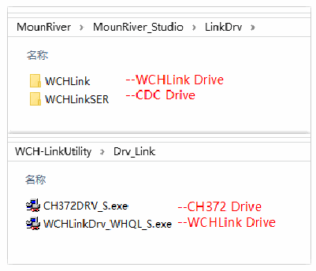
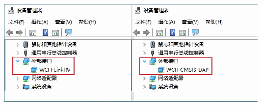
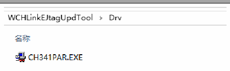
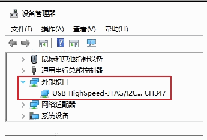
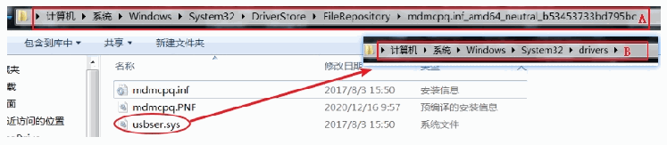
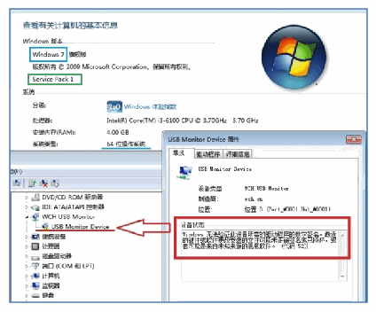

<!-- source-page: 23 -->

[← p.22](0022.md) · [index](../README.md) · [PDF p.23](https://ch32-riscv-ug.github.io/WCH-common/datasheet_zh/WCH-LinkUserManual.PDF#page=23) · [p.24 →](0024.md)

<!-- header: WCH-Link使用说明 https://wch.cn -->

 <!-- p23-draw-image-00003 rendered from the PDF -->

 <!-- p23-draw-image-00002 rendered from the PDF -->

🖼 Text parsed from the figure above

> ⬆ **Table continued** — rendered in full at [page 22](0022.md). <!-- p23-table-001 -->

## 10.2 WCH-LinkE 高速 JTAG 驱动

WCH-LinkE-R0-1v3升级为高速JTAG模式，需手动安装WCH-LinkE高速JTAG驱动才能正常使用。  
请打开WCHLinkEJtagUpdTool安装路径下的Drv文件夹，手动安装CH341PAR.EXE。  

<!-- p23-table-002 (unlabelled-p23-2) -->
<table><tr><th>设备管理器</th><th>驱动路径</th></tr><tr><td></td><td></td></tr></table>

 <!-- p23-draw-image-00005 rendered from the PDF -->

 <!-- p23-draw-image-00004 rendered from the PDF -->

## 10.3 CDC 驱动

WIN7下CDC设备安装问题：  
① 若串口驱动安装成功，则无需以下步骤  
② 确认路径B中是否有usbser.sys文件，如果缺失，从路径A中将其复制到路径B  
③ 重新安装CDC驱动(驱动路径见上表，请安装对应模式下的CDC驱动)  

 <!-- p23-draw-image-00006 rendered from the PDF -->

注：若上述步骤不能解决问题，请参考下方链接  

 <!-- p23-draw-image-00007 rendered from the PDF -->

<!-- image: p23-draw-image-00001 bbox=[507.6, 786.24, 527.04, 796.8] -->
<!-- footer: V2.8 23 -->
